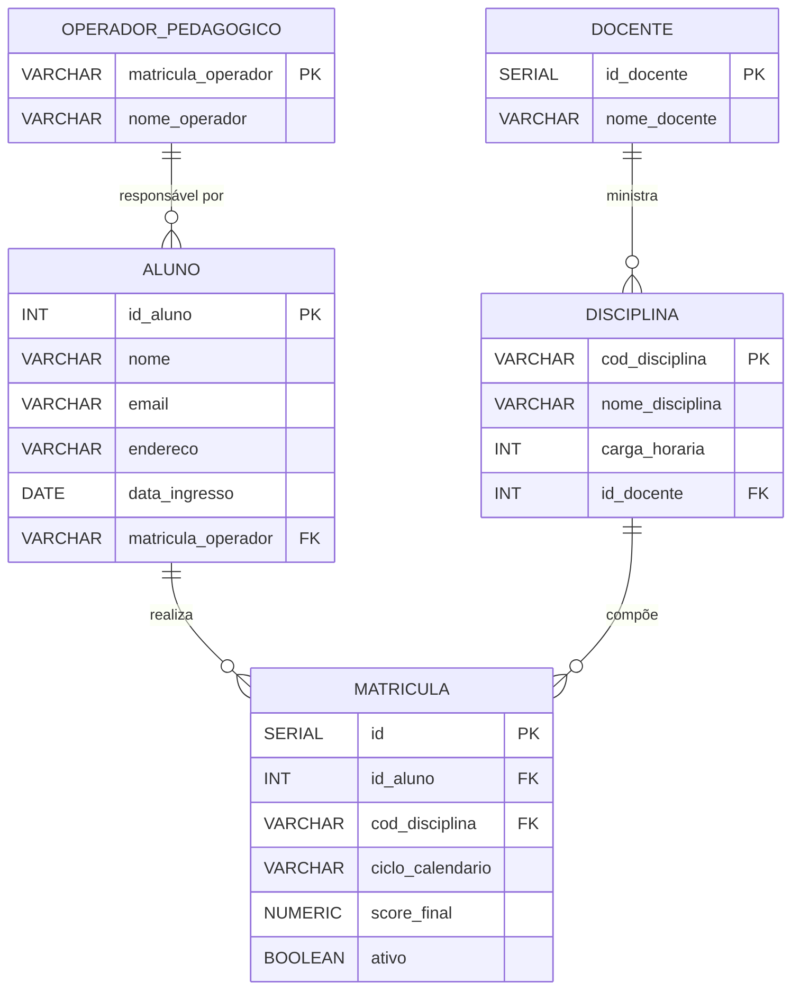

# DER — SigaEdu

```mermaid
erDiagram

    OPERADOR_PEDAGOGICO {
        VARCHAR matricula_operador PK
        VARCHAR nome_operador
    }

    ALUNO {
        INT     id_aluno            PK
        VARCHAR nome
        VARCHAR email
        VARCHAR endereco
        DATE    data_ingresso
        VARCHAR matricula_operador  FK
    }

    DOCENTE {
        SERIAL  id_docente   PK
        VARCHAR nome_docente
    }

    DISCIPLINA {
        VARCHAR cod_disciplina   PK
        VARCHAR nome_disciplina
        INT     carga_horaria
        INT     id_docente       FK
    }

    MATRICULA {
        SERIAL  id              PK
        INT     id_aluno        FK
        VARCHAR cod_disciplina  FK
        VARCHAR ciclo_calendario
        NUMERIC score_final
        BOOLEAN ativo
    }

    OPERADOR_PEDAGOGICO ||--o{ ALUNO       : "responsável por"
    ALUNO               ||--o{ MATRICULA   : "realiza"
    DISCIPLINA          ||--o{ MATRICULA   : "compõe"
    DOCENTE             ||--o{ DISCIPLINA  : "ministra"
```
